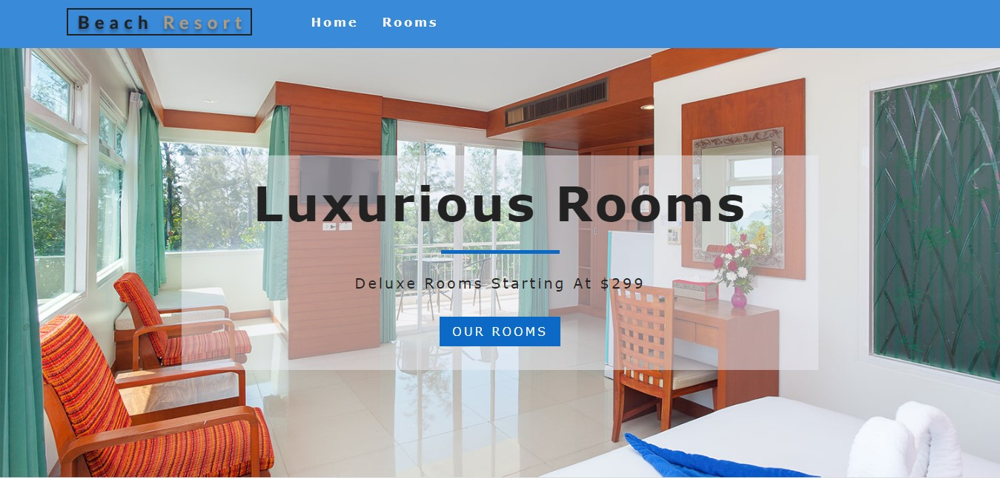

<h2>
    <a href="https://beach-resort-7c171.web.app/">Link to project!</a>
</h2>

This is a beach resort project, built with react. It includes display rooms and set up functionalities, so the users can filter the rooms they want.

I used react router for routing, react context API for state management, contentful headless CMS (also called Bringing Your Own Frontend) data management and netlify to host the application. 

This project is fully responsive. On a smaller screen size, the navbar has a toggle button, and has a traditional navbar display on a bigger screen.

Right after the navbar, there is an hero component where I have the background image. In the middle of the hero component, I have, I included a bar that has a link to route to the room specs. Underneath that, I included services, where I used react icons to display services that the hotel provides. Afterwards, I added featured rooms, which include data for all the rooms in the hotel. Only some of the rooms were displayed as featured. Aside from these featured rooms, there is a page where all the rooms are displayed. Room component was used to display each specific room. In each of the room components, there will be a price for the room, as well as the room name. Also, when you hover over the card, you will have an option of clicking and can navigate to a single room page, where you will have information, just about that specific room. It could be a family, double or single deluxe room. Each specific room page will show unique pictures, details, info and extra info, which will tell the users more about that specific room.

Since I used a react router, if a user, for instance, tries to navigate to a page that does not exist, I have created a custom for a full page, depicting “page not found”. On that page, you either have the option of clicking to return to “our rooms”, or navigate using the navbar. 

When you click on “rooms”, on the navbar, it takes you to all the rooms that the hotel currently provides. Also, since there are multiple rooms, the user has the option of filtering them out. For instance, if you are only interested in the family rooms, and not single or double rooms, you can click on “room type”, to get the display of only family rooms that hotel provides. After filtering to family rooms or any other room type, users also have the opportunity to filter even more, by reducing the price they want.. If users go below the available price, then the page displays an error message, showing, “Unfortunately, No Rooms Matched Your Search Parameters”. This can be further filtered by room size. Also, you can choose a room type, (e.g family room) that allows breakfast and or pets. You can also filter down for rooms, using the number of guests allowed in that room.

Data stored locally

Data stored on contentful and netlify

For styling, I used one main CSS file available in the setup files. While developing the application, only one react hook was used (contentful). I examined multiple options of consuming context API.

The rest of the application was built using functional and class-based components.

2 DEPENDENCIES USED
react-icons
react-router-dom

3 FILES
_redirects file is for redirects. 
App.css is the main css file for the whole application.
Data.js is the local data used in building this app, prior to hooking up everything in to contentful.

Images folder was also used, while developing the app locally
